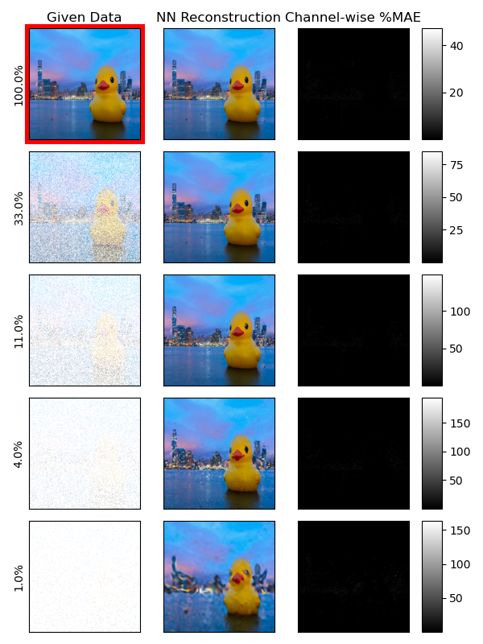

# nn-image-interpolation
Interpolating images with Sinusoidal Representation Networks. Simple example script, based on the paper _Implicit Neural Representations with Periodic Activation Functions_ by Sitzmann et al. (2020).

## How it Works
Neural Networks approximate functions. In this case, I made a network that takes the 2-tuple $(i,j)$, specifying the location of a pixel on an image, as an input and outputs the triplet $(R,G,B)$ describing the color of that pixel. The network is trained on randomly-sampled pixels from an image. After training, the network is queried for all the other points, resulting in a fairly accurate reproduction of the original image from sparsely sampled pixels.


## References
```bibtex
@misc{sitzmann2020implicit,
      title={Implicit Neural Representations with Periodic Activation Functions}, 
      author={Vincent Sitzmann and Julien N. P. Martel and Alexander W. Bergman and David B. Lindell and Gordon Wetzstein},
      year={2020},
      eprint={2006.09661},
      archivePrefix={arXiv},
      primaryClass={cs.CV}
}
```
